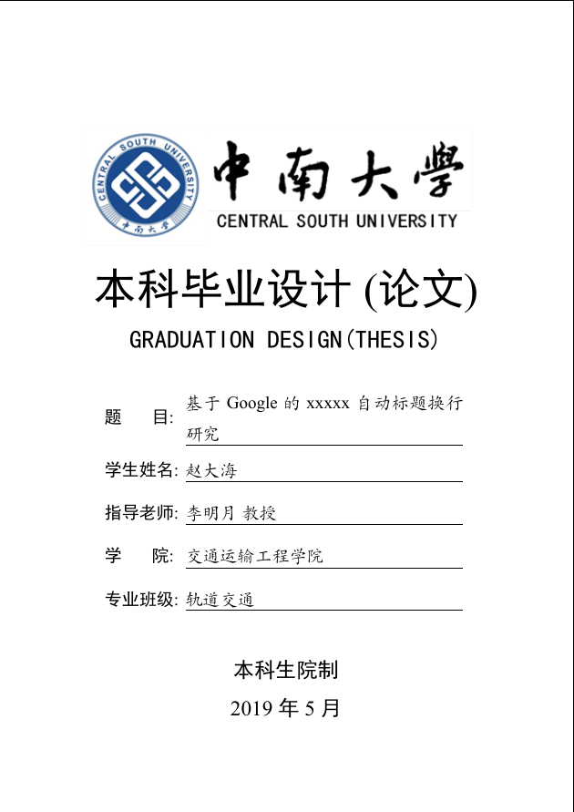

# CSUThesis Latex 模板

## 模板说明

本模板是中南大学论文 Latex 模板 **CSUThesis**，即 **C**entral **S**outh **U**niversity **Thesis** LaTeX Template.

学校的指导文件仅提供大致的格式描述与 word 示例，并没有提供官方的 LaTeX 模板，本项目意在维护一个学位论文的非官方标准（De facto standard），创建符合指导文件要求的 LaTeX 模板，供所有本科生研究生使用。

## 获取模板

### 下载至本地

由于目前模板更新频繁，我们强烈建议您使用**稳定的发布版本**，同时请确保**您已经阅读了示例文档**。

下载途径：

目前仅提供克隆完整 Github 仓库和获取打包的稳定发布版本两个途径

- Github Repository:

  ```shell
  git clone https://github.com/disc0ver-csu/csu-latex-template.git
  ```

  如果 clone 速度过慢，我们建议您使用代理并添加`--depth`参数。

  ```shell
  git clone https://github.com/disc0ver-csu/csu-latex-template.git --depth=1
  ```

- Github Releases:

  最新版

### Overleaf

即将发布

<!-- TODO -->

<!-- ## 模板更新 -->

## 模板使用

如果你是 Visual Studio Code + Tex Live 环境，我们在`.vscode`目录中提供了对应的 LaTeX 插件的配置。如果你希望使用命令行编译整个项目。

<!-- VScode TeXLive 配置方法：[https://www.jianshu.com/p/dc0ffa4368e3](https://www.jianshu.com/p/dc0ffa4368e3) -->

### Linux 和 macOS 用户

<!-- TODO -->

### Windows 用户

<!-- TODO -->

## 其他

### 关于 LaTeX

> LaTeX is not a word processor! Instead, LaTeX encourages authors not to worry too much about the appearance of their documents but to concentrate on getting the right content.

TeX 作为一个优秀的排版软件，在学术界特别是数学、物理学和计算机科学界十分流行，而建立在其上的 LaTeX 也成为国外许多出版商一直在使用的工具。Office Word 虽然具备强大的功能与灵活性，但对于形式固定的论文，排版、编号、参考文献等简单事务反而会带来很多困难与麻烦，对于一些需要通篇修改的问题，要想达到 LaTeX 的效率，Word 对使用者并不算友好。使用 Latex 模板的一大好处是可以避免繁琐的格式设置，使作者可以专注于内容创作。对于全篇格式的修改，仅需要修改 tex 文件所使用的模板一行内容，重新编译便可得到具备新样式的文档，这对于习惯使用 Word 创作的人来说很不可思议。

### 关于项目

清华大学、上海交通大学、中国科学技术大学、中国科学院大学、武汉大学等国内高校都有长期维护、较为稳定的学术论文 LaTeX 模板，相比较之下，中南大学虽有一些前辈提供了宝贵的设计经验，比如最初设计博士 LaTeX 模板的郭大侠，但 Github 上可查到的项目多数已有相当时间没有维护，并且缺乏像上述高校的学术论文模板的高校、易用的设计。

本项目借鉴前辈们的设计经验，以及清华大学、上海交通大学和中国科学技术大学的学术论文模板，重构了原有的模板。同时转移至 disc0ver 组织下，希望更多的同学可以贡献力量，一起维护该项目。

### 一些毕业流程上与 word 差异的考虑

- **首要条件**：和你的导师沟通好，如果他知道 Latex 最好，不知道的话询问他是否接受在 PDF 上进行审阅
- **查重** ：未测试生成的 PDF 是否可以被正确识别，有勇士直接使用 PDF 查重失败或成功的可以提 issue 告诉我，附上编译环境和查重系统。变通方法如下：直接打开 Latex 生成的 PDF 文件，word 会提示将 PDF 转为 docx 文件，转换后字体样式可能会回到 word 自带（Linux 下 texlive 使用的宋体和黑体是 Fandol 系列字体,windows 没有）,但是内容全部保留，格式也会保留大部分,直接用该 docx 可以完美通过查重。如果因为各种原因有转为 docx 的需求也可以采用此方法！
- **格式审查**: 各不同院系尺度不同，无法一概而论。

## 更新日志

- 2021/01/25: Edwardzcn 重构项目，对照学校指导文件重新修改样式，并修复目录显示的问题
- 2019/12/13: BlurryLight 进行了一些代码更新
- 2019/05/01: BlurryLight 在[CSU-Thesis-Latex-Template](https://github.com/CSGrandeur/CSU-Thesis-LaTeX-Template) 的基础上进行修改出本科学位论文模板

## 致谢

- 感谢最先制作出中南大学博士学位论文 LaTeX 模板的郭大侠[@CSGrandeur](https://github.com/CSGrandeur)
- 感谢添加本科学位论文样式支持的[@BlurryLight](https://github.com/BlurryLight)
- 感谢帮助重构项目并进行测试的[@burst-bao](https://github.com/burst-bao)
- 感谢[CTeX-kit](https://github.com/CTeX-org/ctex-kit) 提供了 LaTeX 的中文支持
- 感谢上海交通大学学位论文 LaTeX 模板的维护者们[@sjtug](https://github.com/sjtug) 和 清华大学学位论文 LaTeX 模板的维护者们[@tuna](https://github.com/tuna/)给予的宝贵设计经验

<!-- ## 主要内容



- 封面
- 中文摘要；
- 英文摘要；
- 目录；
- 符号说明（必要时）；
- 论文正文；
- 致谢。
- 参考文献；
- 附录（必要时）；

## 版本状况

完整支持本科论文。

## 文件介绍

### `CSUthesis.cls`

样式文件，一般不需要管这个文件。

其他如涉密、定向之类的，目前本版本没有设计特定的设置功能，需要修改该文件。

对 LaTeX 有所了解的同学，也可按需修改这个文件。如果这个文件的样式设计有什么 bug，欢迎在 issue 里提出。

### `gbt7714-unsrt.bst`和`gbt7714.sty`两个文件

来自项目[CTeX-org/gbt7714-bibtex-style](https://github.com/CTeX-org/gbt7714-bibtex-style)，是参考文献的样式，与学校论文撰写规范一致。

### `content`目录

所有论文的编辑内容在这里。

`info.tex`：论文的各种信息，标题姓名学院之类的。

`abstactcn.tex`和`abstracten.tex`：中文摘要和英文摘要。

`content.tex`：从绪论到总结的全部正文内容。`\cite`的时候可能因为 tex 文件与主文件分离，LaTeX 环境配置不到位，会有找不到 bib 的提示（Texlive+sublime 会这样），没关系，照常插入需要的 bibkey 即可。

`thanks.tex`：致谢
`additional.tex`：附录(不用时可以注释掉)
`subchapters/` : 内容分章节往里填就可以了

### `csuthesis_main.tex`

论文主文件，正常情况下不用修改这个文件，以这个文件编译论文即可。

在 content 目录提供的页面不足以保证所需内容时，可以修改主文件，引入其他自定义 content 文件。

### `images`目录

放图片，模板已经配置了相对路径，所以在文中插图片时，直接用 images 目录下的相对路径即可，比如`images/csu.png`，在正文中插入只需要`csu.png`。

### `KaiTi_GB2312.tff`

**注意:** 由于学校的论文格式中需要用到该字体，但是可能由于系统的原因，并没有带上该字体，需要自行从网上下载，并命名为`KaiTi_GB2312.tff`放置在与`csuthesis_main.tex`同目录下。

## 编译

### 如果你使用命令行编译

#### 手动编译

1. 清空`.aux`文件。
2. 使用`xelatex`对`csuthesis_main.tex`文件进行编译。
   `xelatex csuthesis_main.tex`
3. 使用`biber`对参考文献进行编译。
   `biber csuthesis_main`
4. 再重新编译主 tex 文件
   `xelatex csuthesis_main.tex`

#### 自动化编译

- 可以使用`make`编译
  需要 latexmk 和 wordcount 支持。
  `make {all|wordcount|clean|cleanall|view|zip`

- 也可以直接使用 latexmk
  `latexmk .`

### 如果你使用 TexStudio 等 IDE

- 可以从 content 的任意章节开始编译，也可以从`csuthesis_main.tex`开始。

使用高级文本编辑器，如 sublime 等，否则可能因为 ANSI、UTF-8 等编码格式问题编译失败。

 -->
